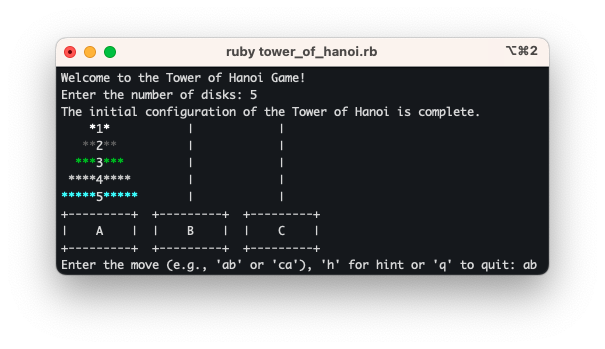
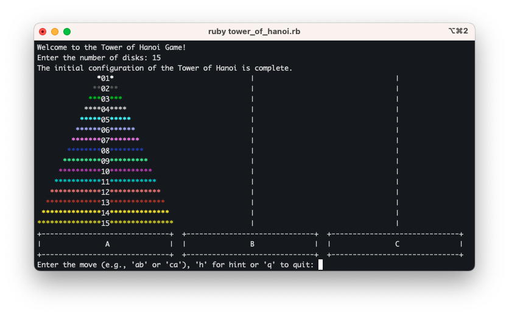

# Tower of Hanoi Game

Welcome to the Tower of Hanoi game! This is a Ruby-based command-line implementation of the classic puzzle game. The goal of the game is to move a tower of disks from one peg to another while following the rules of the Tower of Hanoi puzzle.

## Getting Started

To play the game, you'll need to have Ruby installed on your computer. If you don't have Ruby installed, you can download it from the official website: [Ruby Downloads](https://www.ruby-lang.org/en/documentation/installation/).

Once you have Ruby installed, follow these steps to run the game:

1. Clone or download this repository to your computer.
2. Open your terminal or command prompt.
3. Navigate to the directory where you've placed the game files.
4. Install gems by executing the following command:
    `$ bundle install`

5. Run the game by executing the following command:
    `$ ruby tower_of_hanoi.rb`

Follow the on-screen instructions to play the game. You'll be prompted to enter the number of disks, make moves, get hints, and more!

## How to Play

- Enter the number of disks you want to play with.
- Use the command-line interface to make moves by specifying the source and target pegs (e.g., 'ab' or 'ca').
- Enter 'h' to get a hint on your next move.
- Enter 'q' to quit the game at any time.
- The goal is to move all the disks from peg 'A' to peg 'C' following the rules of the Tower of Hanoi puzzle.

## Game Rules

- You can only move one disk at a time.
- A larger disk cannot be placed on top of a smaller disk.
- You can only move the top disk from one peg to another peg or an empty peg.

## Screenshots

## Contributors

- [Lucas](https://github.com/lucaslight) - The game developer

## License

This project is licensed under the MIT License. See the [LICENSE](LICENSE) file for details.

## Acknowledgments

- Special thanks to [Colorize](https://github.com/fazibear/colorize) for making the game colorful.

**Have fun playing the Lucas' Tower[[2]](https://en.wikipedia.org/wiki/Tower_of_Hanoi#cite_note-2) game!**
